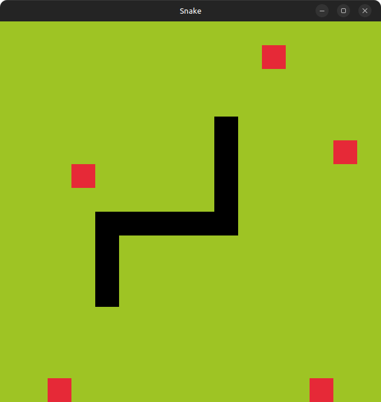

[](https://github.com/Jakooob14/snake-raylib/releases/latest)
[](https://wakatime.com/badge/user/018d2399-7da0-4cc1-ab9f-7482a9a3964f/project/e203a984-e558-4555-9002-5a9d0018836b)

# Snake Raylib

A classic Snake game built with [raylib](https://www.raylib.com/).
Made for learning C++ game development.

---

## 🎮 Features

* Grow your snake by collecting fruit
* Change the number of fruit on the grid
* Adjustable grid size
* Simple 2D gameplay

---

## 🚀 Build & Run

Clone this repo and compile with:

### Create build folder

```bash
cmake -B build -DCMAKE_BUILD_TYPE=Release
cmake --build build
```

### Run the game

```bash
./build/snake-raylib/snake-raylib           # (Linux / macOS)
./build/snake-raylib/Release/snake-raylib.exe # (Windows)
```

---

## 🎯 Controls

* **Move Snake:** `Arrow Keys`
* **Exit Game:** `Esc`

---

## 📷 Screenshot



---

## 📚 Learning Goals

* Practice C++ basics
* Game loop structure
* Input handling
* Collision detection
* Dynamic object management (snake & fruit)
